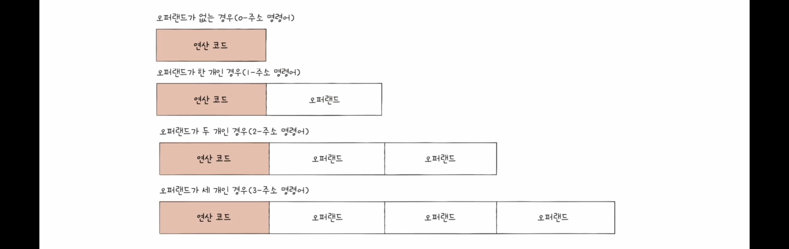

# 명령어

명령어는 연산코드, 오퍼랜드로 이루어진다.

---
## 연산코드
- 명령어가 수행할 연산

### 종류
- 데이터 전송
- 산술/논리 연산
- 제어 흐름 변경
- 입출력 제어

---
## 오퍼랜드
- 연산에 사용할 데이터, 혹은 연산에 사용할 데이터가 저장된 위치
- 주로 주소값이 저장된다. 명령어의 길이는 제한되어 있기 때문에.

### 주소 지정 방식
- 연산에 사용할 데이터 위치를 찾는 방법
- **유효주소**: 연산의 대상이 되는 데이터가 저장된 위치

1. 즉시 주소 지정 방식

   오퍼랜드 필드에 바로 데이터를 명시

2. 직접 주소 지정 방식

   오퍼랜드 필드에 유효주소를 명시

3. 간접 주소 지정 방식

   오퍼랜드 필드에 유효주소의 주소를 명시 (유효주소의 길이가 더 길어질 수 있음, 대신 위방식보다 더 느림)

4. 레지스터 주소 지정 방식

   오퍼랜드 필드에 연산에 필요한 데이터가 저장된 레지스터를 명시 (레지스터는 cpu 내부에 존재해서 메모리에 접근하는 위 방식들보다 빠름)

5. 레지스터 간접 주소 지정 방식

   레지스터에 유효주소를 저장하고 오퍼랜드 필드가 해당 레지스터를 명시

