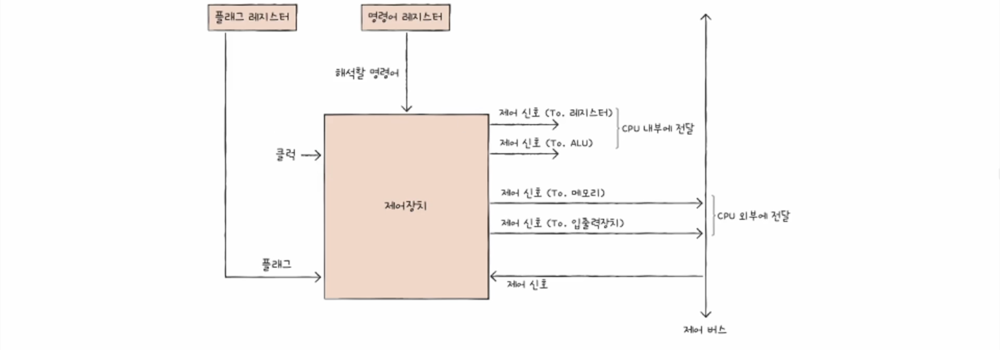
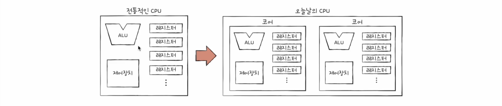
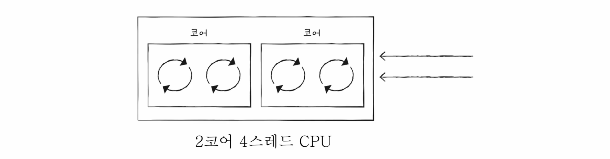

# CPU

---
## 구성

***
### ALU

- 레지스터를 통해 피연산자를 받아들인다.
- 제어장치로부터 수행할 연산을 알려주는 제어 신호를 받아들인다.

- 결과값을 레지스터에 저장한다. (메모리에 게속 저장하면 성능 저하됨.)
- 플래그를 내보낸다. (플래그 레지스터에)

#### 플래그
연산 결과에 따른 추가 정보

1. 부호 플래그: 연산결과의 부호 나타냄 (1: 음수, 0: 양수)
2. 제로 플래그: 연산 결과가 0인지 아닌지 나타냄 (1: 0, 0: 0이 아님)
3. 캐리 플래그: 연산 결과 올림수나 빌림수가 발생했는지 나타냄 (1: 발생, 0: 안발생)
4. 오버플로우 플래그: 오버플로우 발생여부 (1: 발생, 0: 안발생)
5. 인터럽트 플래그: 인터럽트 가능한지 나타 (1: 가능, 0: 불가능)
6. 슈퍼바이저 플래그: 커널모드인지 사용자모드인지 나타냄 (1: 커널, 0: 사용자)

***
### 제어장치

***
### 레지스터

1. 프로그램 카운터(PC) = 명령어 포인터(IP): 메모리에서 가져올 명령어의 주소, 메모리에서 읽어 들일 명령어의 주소를 저장.
2. 명령어 레지스터(IR): 해석할 명령어, 방금 메모리에서 읽어 들인 명령어 저장
3. 메모리 주소 레지스터(MAR): 메모리의 주소를 저장하는 레지스터
4. 메모리 버퍼 레지스터(MBR) = 메모리 데이터 레지스터(MDR): 메모리와 주고받을 값을 저장하는 레지스터
5. 플래그 레지스터(FR): 연산 결과 또는 CPU 상태에 대한 부가적인 정보를 저장하는 레지스터
6. 범용 레지스터(GPR): 일반적인 상황에서 자유롭게 사용가능, 데이터, 주소 다 저장 가능.
7. 스택 포인터: 메모리의 스택 영역에 가장 최근에 저장된 값의 위치를 저장하는 레지스터.
8. 베이스 레지스터: 주소 지정 방식에서 베이스 레지스터를 이용할 때 사용된다.

#### 스택 주소 지정 방식
- 스택 포인터를 이용
#### 상대 주소 지정 방식
- 프로그램 카운터와 오퍼랜드 값을 더해서 주소를 알아냄
#### 베이스 레지스터 주소 지정 방식
- 베이스 레지스터 값과 오퍼랜드 값을 더해서 주소를 알아냄

***
## 명령어 사이클 (instruction cycle)

프로그램은 여러 명령어로 이루어져 있고, 이 명령어들은 일정한 주기가 반복되며 실행된다.
이 주기를 명령어 사이클 이라고 한다. (하나의 명령어를 처리하는 정형화된 흐름)

1. 인출 사이클(fetch cycle): 명령어를 메모리에서 cpu까지 가지고 오는 단계
2. 실행 사이클(execution cycle): cpu로 가져온 명령어를 실행
3. 간접 사이클(indirect cycle): 간접 주소 지정 방식 같은 경우 메모리 접근이 한번 더 필요하다.

## 인터럽트 (Interrupt)

cpu의 작업을 방해하는 신호

- 동기 인터럽트(예외): cpu에 의해 발생하는 인터럽트. 프로그래밍상의 오류와 같은 예외적인 상황에 마주쳤을 때 발생
- 비동기 인터럽트(하드웨어 인터럽트): 주로 입출력 장치에 의해 발생.

### 하드웨어 인터럽트
명령어를 효율적으로 처리하기 위한 인터럽트

입출력 장치는 cpu보다 느리다. 따라서 입출력 장치의 결과를 받아야 하는 명령어가 실행되었을 때,
cpu는 언제 끝날지도 모르는 입출력 장치가 완료되는 시점까지 아무것도 못한다. 이는 낭비다.
따라서 하드웨어 인터럽트를 사용해서, cpu는 입출력 장치가 일하는 동안 다른 명령어들을 수행하다가,
입출력 장치로 부터 하드웨어 인터럽트가 오면 상황봐서 인터럽트를 받는다.

- 처리순서
1. 입출력 장치가 cpu에 **인터럽트 요청 신호** 보낸다.
2. cpu는 실행 사이클이 끝나고 다음 명령어를 인출하기 전에 인터럽트 여부 확인한다.
3. 인터럽트 요청이 있다면, 인터럽트 플래그 확인해서 현재 인터럽트 받아들일 수 있는 상황인지 본다.
4. 인터럽트 받을 수 있으면 지금까지 작업을 메모리 스택영역에 백업한다.
5. cpu는 인터럽트 벡터를 참조하여 인터럽트 서비스 루틴 실행한다.
6. 인터럽트 서비스 루틴 끝나면 백업해둔 작업 복구해서 실행한다.

- 인터럽트 요청 신호: 끼어들어도 되냐고 묻는 신호
- 인터럽트 플래그: 인터럽트를 받을지 말지 결정하는 플래그. 받기싫어도 우선순위가 더 높은 하드웨어 인터럽트 발생하면 하드웨어 인터럽트 부터 처리한다.
- 인터럽트 서비스 루틴 = 인터럽트 핸들러: 인터럽트 처리 위한 프로그램
- 인터럽트 벡터: 인터럽트 서비스 루틴을 구분하기 위한 인터럽트 서비스 루틴을 식별하기 위한 정보

***
# CPU 성능 향상 기법

***
## 클럭

- 클럭 속도 단위: 헤르츠(Hz)
- 클럭 신호가 빠르게 반복되면 cpu를 비롯한 컴퓨터 부품들은 빠른 박자에 맞춰 움직인다. -> 성능향상
- 클럭 속도가 분명 성능 향상이긴 하지만 과도하게 높이면 발열문제 발생 -> 클럭 속도만으로 cpu 성능 올리는데에는 한계가 있다.

## 코어와 멀티코어

- 코어: 명령어를 실행하는 부품
- **멀티코어 cpu = 멀티코어 프로세서**: 코어 여러개 포함한 cpu
- 코어가 무작정 많아진다고 성능이 비례해서 상승하지는 않다.
- 코어마다 처리할 명령어들을 얼마나 적절하게 분배하느냐가 중요하다. <- 연산속도 결정

## 스레드와 멀티스레드

### 스레드

- 실행 흐름의 단위
- 하드웨어적 스레드, 소프트웨어적 스레드로 나뉜다.

#### 소프트웨어적 스레드
- 하나의 프로그램에서 독립적으로 실행되는 단위

#### 하드웨어적 스레드 (= 논리 프로세서)

- 하나의 코어가 동시에 처리하는 명령어 단위.
- ex) 2코어 4스레드: 하나의 코어에서 2개의 명령어를 실행 가능, 따라서 4개의 명령어를 처리할 수 있는 cpu
- **멀티스레드 프로세서 = 멀티스레드 cpu**: 하나의 코어로 여러 명령어를 동시에 처리하는 cpu

- 핵심은 레지스터이다. 하나의 코어로 여러 명령어를 처리하게 하려면 꼭 필요한 레지스터(ex. 프로그램카운터)를 여러개 가지고 있으면 된다.

***
## 명령어 병렬 처리 기법

### 명령어 파이프라이닝

1. 명령어 인출 (instruction fetch)
2. 명령어 해석 (instruction decode)
3. 명령어 실행 (execute instruction)
4. 결과 저장 (write back)

- 같은 단계가 겹치지만 않는다면 cpu는 각 단계를 동시에 실행할 수 있다.
- 특정 상황에서 성능 향상에 실패하는 경우가 있다.

#### 파이프라인 위험
1. 데이터 위험: 명령어 간 **'데이터 의존성'** 에 의해 발생한다. (이전 명령어의 결과값이 다음 명령어에 필요한 경우)

2. 제어 위험: 분기 등으로 인한 '프로그램 카운터' 의 갑작스러운 변화에 의해 발생. (jump 같은 거 때문에 미리 파이프라인으로 가져와서 인출하고 해석했던 명령어들이 쓸모 없어진 경우 인것 같다.)
    - 분기 예측: 이를 예측해서 그 주소를 인출하는 기술.

3. 구조적 위험(= 자원 위험): 명령어들을 겹쳐 실행하는 과정에서 서로 다른 명령어가 동시에 ALU, 레지스터 같은 cpu 부품을 사용하려고 할 때 발생.

### 슈퍼스칼라
- 여러개의 파이프라인을 이용한다.
- cpu 내부에 여러개의 명령어 파이프 라인을 포함한 구조이다.
- 예를 들어 멀티스레드 프로세서는 한번에 여러 명령어 인출, 해석, 실행이 가능하기 때문에 슈퍼스칼라 구조 사용이 가능하다.
- 파이프라인이 많아서 파이프라인 위험 방지를 위해 더 고도로 설계되어야 한다.

### 비순차적 명령어 처리 (OoOE)
- 파이프라인의 중단을 방지하기 위해 명령어를 순차적으로 처리하지 않는 기법
- 명령어들 간의 데이터 의존성을 파악해서 파이프라인에 넣을 순서를 바꾼다.

***
## 명령어가 생겨먹은 생김새
- 파이프라이닝과 슈퍼스칼라 기법을 cpu에 적용하려면 명령어가 파이프라이닝에 최적화 되어 있어야 한다.

### 명령어 집합
- cpu 마다 이해할 수 있는 명령어는 각기 다르다.
- 명령어 집합(instruction set) = 명령어 집합 구조(ISA - instruction set architecture): cpu가 이해할 수 있는 명령어들의 모음
- 똑같은 코드도 cpu에 따라서 ISA가 다르기 때문에 어셈블리어로 컴파일한 결과가 달라질 수 있다.

### CISC
- 복잡한 명령어 집합을 활용하는 컴퓨터
- 가변 길이 명령어 사용: 다양하고 강력한 기능의 명령어 집합을 사용. -> 명령어 형태와 크기가 다양.

장점: 메모리를 최대한 아끼며 개발하던 시절엔 좋았다. 상대적으로 적은 수의 명령어로도 프로그램 동작 가능해서

단점:명령어의 크기와 실행되기까지의 시간이 일정하지 않다. (여러 클럭주기가 필요) -> 파이프라인이 효율적인 동작을 할 수 없다.
-> 따라서 현대 CISC는 내부에서 명령어를 잘게 분해해서 RISC 처럼 동작한다.

### RISC
- 짧고 규격화된 명령어, 되도록 1클럭 내외로 실행되는 명령어 지향.
- 고정 길이 명령어 활용: 파이프라이닝에 최적화
- 메모리 접근을 단순화 하고 최소화 한다. -> 레지스터 적극 활용
- CISC 보단 명령어 종류가 적어서 더 많은 명령어로 프로그램을 실행한다.